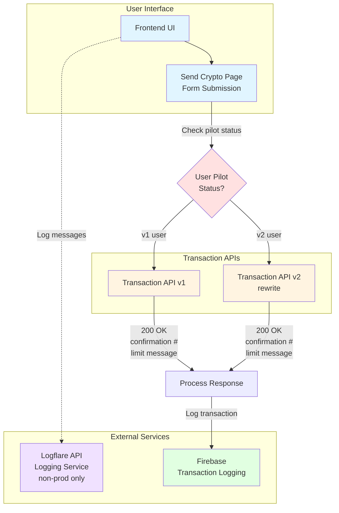

# Outages

Welcome to the workshop! This HTML / CSS / JavaScript front-end will help you explore how to debug a production code base in an outage situation.

This code base is intended to represent an aged / legacy production app. Many developers have worked on the code over the years, and it now contains a lot of technical debt and code / architecure smells. This includes, but is not limited to:

    - tightly coupled dependencies
    - lack of code reuse / standardization
    - inconsistent / missing logging

All of these are issues that you may encounter in real production code bases.

Aim to optimize the code and replace tactical fixes with maintainable code when you can, but production stability always comes first.



## Background

The code behaves differently in development (localhost) versus production. Why? Because of CORS.

<b>What is CORS?</b>

Per the [auth0](https://auth0.com/blog/cors-tutorial-a-guide-to-cross-origin-resource-sharing/) and [concord](https://www.concordusa.com/blog/what-is-cors-and-why-does-it-keep-coming-up-in-my-projects) blogs:

    Cross-Origin Resource Sharing (CORS) is a protocol that enables scripts running on a browser client to interact with resources from a different origin.

    Both XMLHttpRequest and fetch follow the same-origin policy, where JavaScript can only make calls to URLs that live on the same origin as the location where the script is running.

    This helps keep users safe from cross-origin requets that could compromise their data.

<b>Does this mean I will encounter CORS errors for every request?</b>

    No. Servers can be configured to allow cross-origin resource sharing via special headers like the <b>Access-Control-Allow-Origin</b> header, which determines which origins can access a resource.

    When a web browser makes a request to the server, it will use these special headers to determine whether to allow the XMLHttpRequest / fetch request to continue. If not, the browser will block the request.

<b>How do I know if the URL I'm making a request to is on a different origin?</b>

    The URL's scheme (HTTP or HTTPS), domain, and/or port will be different.

<b>Why do I need a proxy for development, but not production?</b>

    Most servers are not (and should not be) configured to allow localhost as an origin.

    In a development environment, you can use a proxy to bypass CORS issues. Instead of the browser making a request to the URL directly, it makes a request to a proxy, which adds any necessary headers and forwards the request to the URL.

## Setup instructions

### 1. Install dependencies

```bash
cd crypto-wallet
npm i
```

### 2. Start frontend and proxies in one command

```bash
npm start
```

## Logging

You can see development logs at:
https://logflare.app/sources/public/9t3K-rwLUo8Xzto7

There is currently no support for logging in production.
